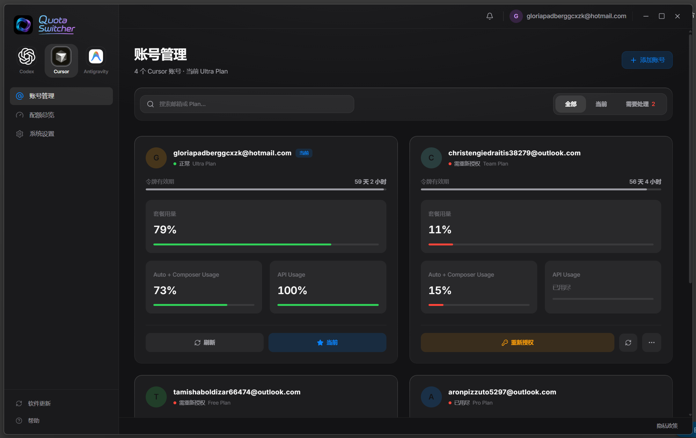
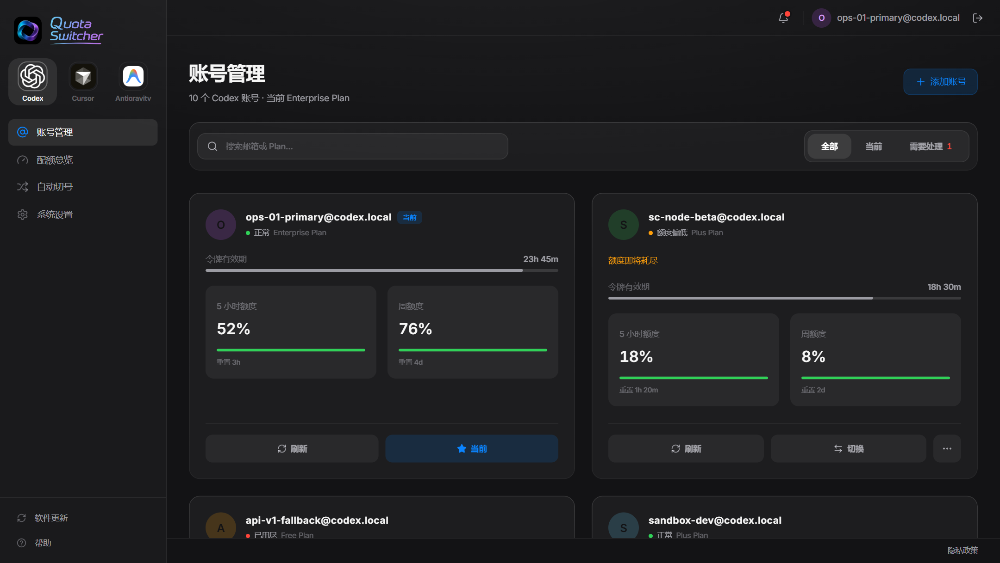
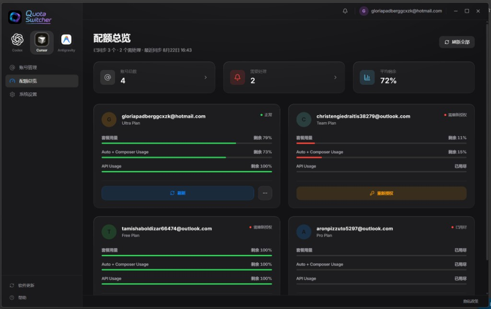
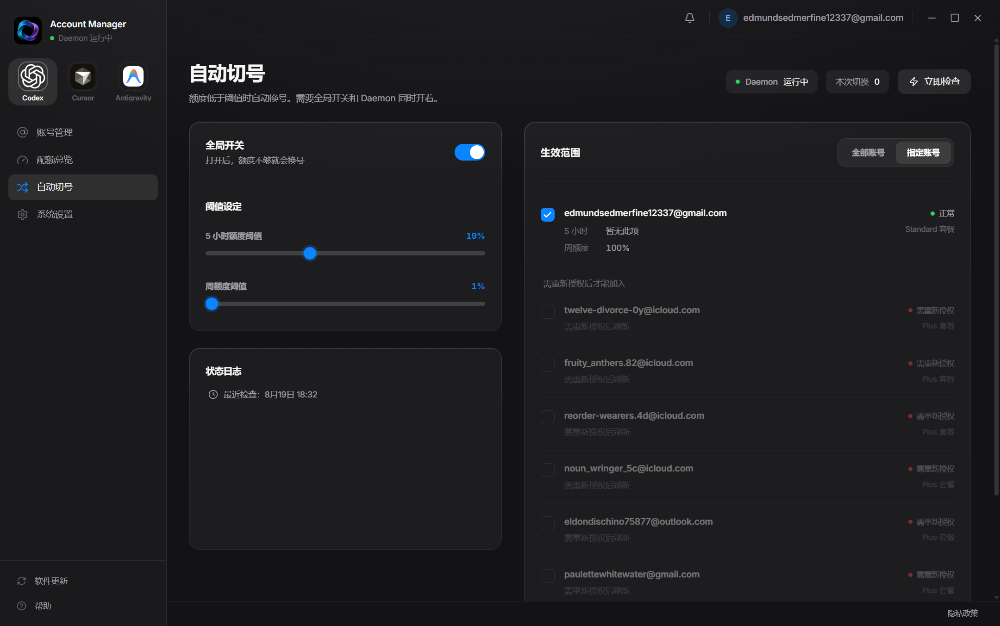
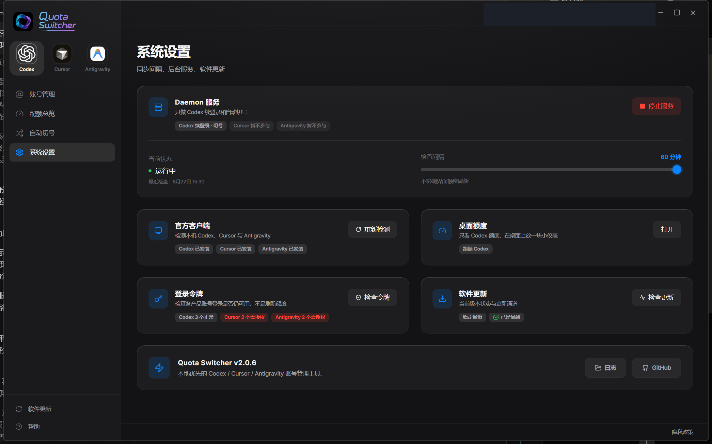
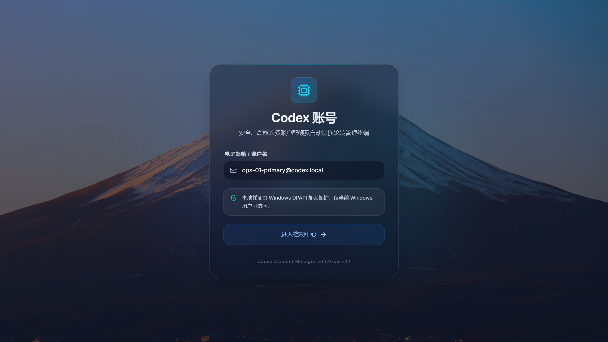
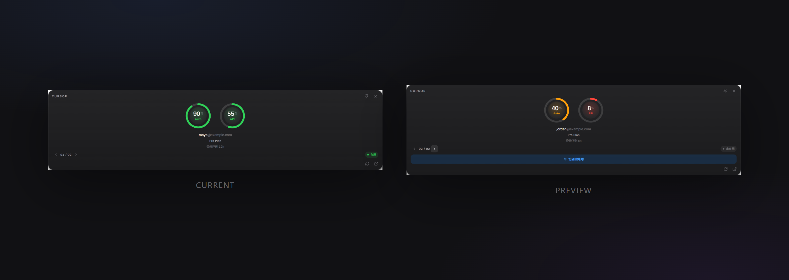

<div align="center">

# Codex Account Manager

Several Codex and Cursor accounts, one Windows window.

[](https://github.com/3xiaoshayu/codex-account-manager/releases)
[](https://github.com/3xiaoshayu/codex-account-manager/actions/workflows/ci.yml)

[](LICENSE)

[Download](https://github.com/3xiaoshayu/codex-account-manager/releases) ·
[Troubleshooting](docs/troubleshooting.en.md) ·
[Privacy](docs/privacy.en.md) ·
[简体中文](README.md)

</div>



> [!IMPORTANT]
> The installer is not signed yet, so Windows may warn about an unknown
> publisher. Download only from this repository's
> [Releases](https://github.com/3xiaoshayu/codex-account-manager/releases)
> page and check the SHA-256.

## What this is

The sidebar switches **Codex** / **Cursor**. One card per account, remaining
quota at a glance. When you switch, it updates the official client's login.
Accounts stay on this PC.

It cannot raise anyone's limits. Auto-switch only moves between your saved
Codex accounts. Cursor can show usage and switch by hand; it does not
auto-switch.

## What it does

**Codex** — 5-hour and weekly quota. Import the login already on this PC, or
sign in through the browser. A switch writes the official Microsoft Store
Codex app. When usage is low, a background worker switches at the line you
set. Closing the window does not stop it.

**Cursor** — plan, Auto, and API. Import the local login or sign in through
the browser, then write official Cursor. The official current login is marked
as current.

**Both** — close to the tray, a small desktop quota ring, and a check for how
long the login still lasts. No telemetry and no cloud of ours.

A switch closes the matching official app first. Finish the work in front of
you before you switch.

## Interface

<table>
  <tr>
    <td align="center"><sub><b>Codex accounts</b></sub></td>
    <td align="center"><sub><b>Cursor quotas</b></sub></td>
  </tr>
  <tr>
    <td></td>
    <td></td>
  </tr>
  <tr>
    <td align="center"><sub><b>Codex auto-switch</b></sub></td>
    <td align="center"><sub><b>Settings</b></sub></td>
  </tr>
  <tr>
    <td></td>
    <td></td>
  </tr>
  <tr>
    <td align="center"><sub><b>Login</b></sub></td>
    <td align="center"><sub><b>Desktop quota lens</b></sub></td>
  </tr>
  <tr>
    <td></td>
    <td></td>
  </tr>
</table>

The first image is the Cursor account page. The close button hides the window
to the tray; it does not quit.

## Install

Windows 10 or 11 (x64). Codex needs the official Microsoft Store Codex app.
Cursor needs official Cursor. You can use either one on its own.

1. Open [Releases](https://github.com/3xiaoshayu/codex-account-manager/releases) and download `Codex-Account-Manager-Setup-<version>-x64.exe`
2. Install and open it
3. Pick Codex or Cursor in the sidebar, then import the login already on this PC or finish sign-in in the browser
4. The cards and quotas should be there when you come back

The ZIP also runs; data still lives in your user profile. Update betas by
hand.

```powershell
Get-FileHash ".\Codex-Account-Manager-Setup-<version>-x64.exe" -Algorithm SHA256
```

Compare that with `SHA256SUMS.txt` from the same release.

## Where data lives

| Path | Use |
| --- | --- |
| `%USERPROFILE%\.codex-switch` | The manager's own accounts, settings, and logs |
| `%USERPROFILE%\.codex\auth.json` | Written on a Codex switch, after `auth.json.bak` |
| `%APPDATA%\Cursor\User\globalStorage\state.vscdb` | Official Cursor login written on a Cursor switch |

Outbound calls go to OpenAI / ChatGPT, Cursor, and GitHub. Windows encryption
will not help if someone already controls this PC. Details are in
[Privacy](docs/privacy.en.md).

If official Codex and the manager disagree, the window asks whether to adopt
the official login or write the managed one back.

## Running from source

Node.js 22 or newer (CI uses 24 LTS):

```powershell
git clone https://github.com/3xiaoshayu/codex-account-manager.git
cd codex-account-manager
npm ci
npm test
npm start
```

Package with `npm run build:dir` or `npm run build:windows`.

## Docs

[Privacy](docs/privacy.en.md) ·
[Troubleshooting](docs/troubleshooting.en.md) ·
[Support](SUPPORT.en.md) ·
[Security](SECURITY.en.md) ·
[Changelog](CHANGELOG.md)

For contributors: [Architecture](docs/architecture.md) ·
[Contributing](CONTRIBUTING.md) ·
[Releasing](docs/releasing.md)

## Notes

This is an independent community project, not affiliated with or endorsed by
OpenAI or Anysphere / Cursor. OpenAI, Codex, ChatGPT, and Cursor are trademarks
of their respective owners.

Only manage accounts you own or are clearly allowed to use. Windows x64 only,
for now. Storage and quota parsing may still change during prerelease.

The code is [MIT](LICENSE). Icon and installer art are covered by
[ASSET_LICENSE.md](ASSET_LICENSE.md).
