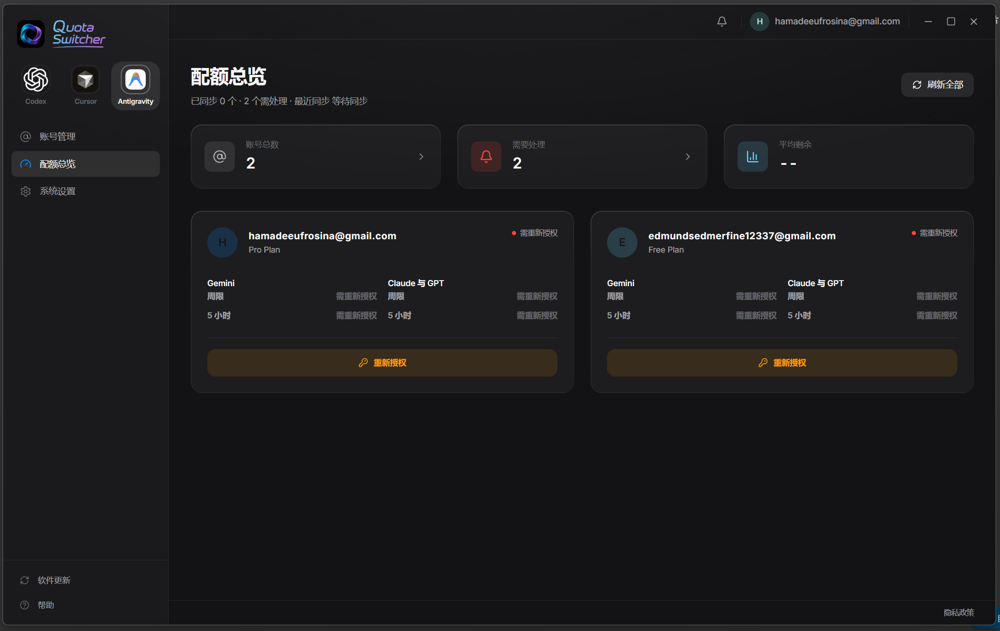
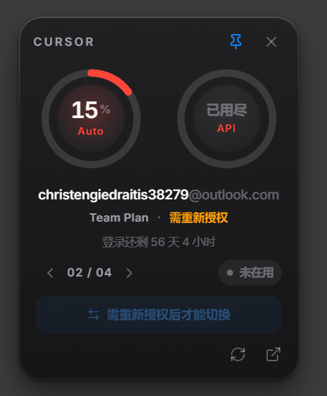
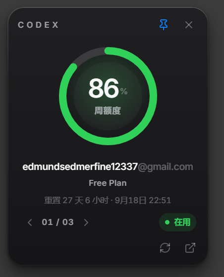
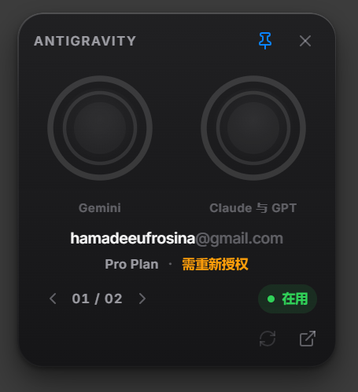

<div align="center">

# Quota Switcher

View and switch Codex, Cursor, and Antigravity accounts on Windows.
Quotas, logins, and credentials stay on this PC and are encrypted for the
current Windows user.

[](https://github.com/3xiaoshayu/quota-switcher/releases)
[](https://github.com/3xiaoshayu/quota-switcher/actions/workflows/ci.yml)

[](LICENSE)

**[Download](https://github.com/3xiaoshayu/quota-switcher/releases)** ·
[Troubleshooting](docs/troubleshooting.en.md) ·
[Privacy](docs/privacy.en.md) ·
[简体中文](README.md)

The current complete release is **2.0.8**.

</div>


> [!IMPORTANT]
> The installer is not code-signed. Windows may warn about an unknown
> publisher. Download only from this repository's
> [Releases](https://github.com/3xiaoshayu/quota-switcher/releases)
> page and check the SHA-256 in `SHA256SUMS.txt` on the same release.
> 2.0.8 is still unsigned.

## What this is

Quota Switcher is a Windows-local vault, quota view, and switch tool for
Codex, Cursor, and Antigravity IDE. 2.0.8 is the current complete product.

It writes the official login on this PC. It cannot raise anyone's official
limits or bypass upstream restrictions.

## Interface

The hero image is Cursor account management. The next seven shots are the
same windows (captured on 2.0.6; later interfaces are unchanged): two quota
overviews, settings, and four desktop quota lenses. The close button hides the
window to the tray; it does not quit.

<table>
  <tr>
    <td align="center"><sub><b>Quota overview</b></sub></td>
    <td align="center"><sub><b>Antigravity quotas</b></sub></td>
  </tr>
  <tr>
    <td></td>
    <td></td>
  </tr>
  <tr>
    <td align="center" colspan="2"><sub><b>Settings</b></sub></td>
  </tr>
  <tr>
    <td colspan="2"></td>
  </tr>
</table>

<table>
  <tr>
    <td align="center"><sub><b>Cursor quota lens</b></sub></td>
    <td align="center"><sub><b>Cursor lens (needs auth)</b></sub></td>
    <td align="center"><sub><b>Codex quota lens</b></sub></td>
    <td align="center"><sub><b>Antigravity quota lens</b></sub></td>
  </tr>
  <tr>
    <td></td>
    <td></td>
    <td></td>
    <td></td>
  </tr>
</table>

## Features

- **Three products, one window.** The sidebar switches between Codex, Cursor,
  and Antigravity. Each account is a card with remaining quota and plan status.
- **Writes the official client.** A switch updates the local official login.
  It does not create a separate cloud session. A switch happens only when you
  click it; there is no background account switching.
- **Background work is login renewal and quota sync only.** After the window
  closes, the worker keeps renewing Codex logins and refreshing quotas, and
  stops to ask you when the official login was changed from outside.
- **Local vault.** The account store is encrypted with current-user Windows
  DPAPI. There is no telemetry and no project-operated cloud.
- **Tray and desktop quota lens.** Close to the tray, keep a desktop quota
  window, and check how long the login still lasts.

A switch closes the matching official process first. Save your work before you
switch.

Antigravity currently targets official **Antigravity IDE** (local import,
Google browser sign-in, switch, quota refresh, float window). It does not
manage legacy `Antigravity.exe`. A failed quota read is not shown as a ban.

## Compared with Cockpit Tools

These are different paths.
[Cockpit Tools](https://github.com/jlcodes99/cockpit-tools) is a general
cockpit for many AI IDEs on three operating systems. Quota Switcher is a
complete **Windows-local vault, quota view, and switch path** for these three
products. Neither is “strictly better” at everything.

| | Quota Switcher | Cockpit Tools |
| --- | --- | --- |
| Scope | Windows Codex / Cursor / Antigravity IDE | Many products on Windows, macOS, and Linux |
| Credentials | Current-user DPAPI; list calls keep `secrets: false`; tokens never enter the renderer | Per-client files and permissions |
| Codex switch | Snapshot, commit as one transaction, roll back on failure; conflicts need 采用 / 写回 | One-click switch and multi-instance |
| Cursor / Antigravity | In-place `state.vscdb` (WAL + `BEGIN IMMEDIATE`); Cursor clears leftover team cache | Also offers multi-instance and wake-up |
| Quota jitter | Timeout / proxy 5xx / empty token / 429 show “额度暂时没刷到，登录还在”; leftover quota stays on the card; 429 is not treated as used-up | Each client’s own refresh and display |
| Not included | Multi-instance, wake-up, Copilot / Windsurf / Trae, and others | This three-product Windows transaction path |
| Signing | Open-source builds may be unsigned; install only from this repo’s Releases + SHA-256 | Open-source builds may also be unsigned |

## Where it goes deep

See [Architecture](docs/architecture.md) for the implementation. This page
only lists the capabilities you can match to the product.

| Area | Behavior |
| --- | --- |
| Vault | DPAPI; list calls use `secrets: false`; tokens are not decrypted into the renderer |
| Codex transaction | Official login, projection, and index are snapshotted together; any later failure rolls the whole step back |
| Honest official login | A leftover lock or non-JSON read is not treated as a conflict; a successful write is not rolled back because a later read is locked |
| Cursor / Antigravity writes | In-place SQLite, not a whole-database copy |
| Quota HTTP | Node, not the window Chromium session; keep-alive agents keyed by proxy signature; a failed proxy is skipped for 60 seconds; GET can fail over to direct; a timed-out token POST is not replayed |
| Backoff | `quota_next_retry_at` / `token_next_retry_at`; Retry-After is honored |
| Background | The worker keeps renewing logins and syncing quotas after the window closes; if the worker is down, GET can fall back in-process; non-idempotent POST is not replayed |

## Install

Windows 10 or 11 (x64). Codex needs the official Microsoft Store Codex app.
Cursor needs official Cursor. Antigravity needs official Antigravity IDE. Any
subset can be used on its own.

1. Open [Releases](https://github.com/3xiaoshayu/quota-switcher/releases) and download `Quota-Switcher-Setup-<version>-x64.exe`
2. Install and open it
3. Choose a product in the sidebar, then **导入本机已登录** or **打开网页授权**
4. Account cards and quotas appear when you return

The ZIP also runs; data still lives in the user profile. Upgrading from
`1.0.x` to 2.0 requires this Setup once so the desktop shortcut is renamed to
Quota Switcher. Later `2.0.x` builds can be checked from inside the app.

```powershell
Get-FileHash ".\Quota-Switcher-Setup-<version>-x64.exe" -Algorithm SHA256
```

Compare the result with `SHA256SUMS.txt` from the same release.

## Where data lives

| Path | Use |
| --- | --- |
| `%USERPROFILE%\.codex-switch` | This app's accounts, settings, and logs |
| `%USERPROFILE%\.codex\auth.json` | Written on a Codex switch, after `auth.json.bak` |
| `%APPDATA%\Cursor\User\globalStorage\state.vscdb` | Official Cursor login written on a Cursor switch |
| `%APPDATA%\Antigravity IDE\User\globalStorage\state.vscdb` | Official Antigravity login written on an Antigravity switch |

Outbound calls go to OpenAI / ChatGPT, Cursor, Google, and GitHub. Windows
encryption will not help if someone already controls this PC. Details are in
[Privacy](docs/privacy.en.md).

If official Codex and this app disagree, the window offers **采用官方账号**
(use the official login) or **写回管理账号** (write the managed one back).

## Notes

This is an independent community project, not affiliated with or endorsed by
OpenAI, Anysphere / Cursor, or Google. OpenAI, Codex, ChatGPT, Cursor, and
Antigravity are trademarks of their respective owners.

Only manage accounts you own or are clearly allowed to use. Windows x64 only.
Every switch is manual; there is no automatic account switching. Antigravity is
official IDE only. The installer is not code-signed.

The code is [MIT](LICENSE). Icon and installer art are covered by
[ASSET_LICENSE.md](ASSET_LICENSE.md).

## Docs

[Privacy](docs/privacy.en.md) ·
[Troubleshooting](docs/troubleshooting.en.md) ·
[Support](SUPPORT.en.md) ·
[Security](SECURITY.en.md) ·
[Code of Conduct](CODE_OF_CONDUCT.en.md) ·
[Changelog](CHANGELOG.md)

For contributors: [Architecture](docs/architecture.md) ·
[Contributing](CONTRIBUTING.en.md) ·
[Releasing](docs/releasing.md)

## Running from source

Node.js 22 or newer (CI uses 24 LTS):

```powershell
git clone https://github.com/3xiaoshayu/quota-switcher.git
cd quota-switcher
npm ci
npm test
npm start
```

Package with `npm run build:dir` or `npm run build:windows`. Implementation
notes are in [Architecture](docs/architecture.md).
