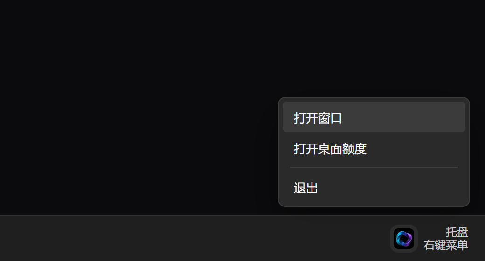

<div align="center">

# Quota Switcher

在 Windows 上查看并切换 Codex、Cursor 与 Antigravity 账号。
额度、登录状态与凭证只保存在本机，并使用当前 Windows 用户加密。

[](https://github.com/3xiaoshayu/quota-switcher/releases)
[](https://github.com/3xiaoshayu/quota-switcher/actions/workflows/ci.yml)

[](LICENSE)

**[下载安装包](https://github.com/3xiaoshayu/quota-switcher/releases)** ·
[故障排查](docs/troubleshooting.md) ·
[隐私说明](docs/privacy.md) ·
[English](README.en.md)

当前完整版是 **2.0.6**。

</div>


> [!IMPORTANT]
> 安装包尚未代码签名，Windows 可能提示“未知发布者”。请只从本仓库
> [Releases](https://github.com/3xiaoshayu/quota-switcher/releases) 下载，并用同一条 Release 中的 `SHA256SUMS.txt` 核对 SHA-256。2.0.6 仍未签名。

## 这是什么

Quota Switcher 是 Windows 上 Codex、Cursor、反重力（Antigravity IDE）的本机账号库、额度查看和切号工具。2.0.6 是当前定稿。

它写入本机官方登录，不能提高任何官方额度，也不能绕过上游限制。

## 界面

顶图为 Cursor 账号页。关闭按钮将窗口收到托盘，不会退出。

<table>
  <tr>
    <td align="center"><sub><b>Codex 账号</b></sub></td>
    <td align="center"><sub><b>配额总览</b></sub></td>
  </tr>
  <tr>
    <td></td>
    <td></td>
  </tr>
  <tr>
    <td align="center"><sub><b>Codex 自动切号</b></sub></td>
    <td align="center"><sub><b>桌面额度镜</b></sub></td>
  </tr>
  <tr>
    <td></td>
    <td></td>
  </tr>
  <tr>
    <td align="center"><sub><b>系统设置</b></sub></td>
    <td align="center"><sub><b>托盘菜单</b></sub></td>
  </tr>
  <tr>
    <td></td>
    <td></td>
  </tr>
</table>

## 功能

- **三个产品，一个窗口。** 侧栏在 Codex、Cursor、Antigravity 之间切换。每个账号一张卡片，剩余额度与套餐状态可直接阅读。
- **写入官方客户端。** 切换时更新本机官方登录，而不是另开一套云端会话。
- **仅 Codex 可在后台自动切换。** 额度低于你设定的阈值时按规则换号；关闭窗口后仍继续运行。Cursor 与 Antigravity 支持查看和手动切换，不提供自动切换。
- **本机保险柜。** 账号库使用当前 Windows 用户的 DPAPI 加密。没有遥测，也没有项目方云服务。
- **托盘与桌面额度镜。** 关闭到托盘，桌面上放置额度浮窗，并可检查登录有效期。

切换会先结束对应的官方进程。请先保存工作再切号。

Antigravity 目前对接官方 **Antigravity IDE**（导入本机登录、Google 网页授权、切换、刷新额度、浮窗）。不管理旧版 `Antigravity.exe`。额度未查清时，不会显示为封号。

## 和 Cockpit Tools

路径不同。[Cockpit Tools](https://github.com/jlcodes99/cockpit-tools) 是覆盖很多 AI IDE、三套系统的通用驾驶舱。Quota Switcher 把 **Windows 上这三家的本机账号库、额度和切号** 做成完整产品。不是「全面更强」，各做各的。

| | Quota Switcher | Cockpit Tools |
| --- | --- | --- |
| 范围 | Windows 上 Codex / Cursor / 反重力 IDE | 十几家产品，Windows / macOS / Linux |
| 凭证 | 当前用户 DPAPI；列表不解密；token 不出渲染进程 | 按各客户端文件和权限处理 |
| Codex 切号 | 快照后整段提交，失败回滚；冲突要人点「采用 / 写回」 | 侧重一键切和多开 |
| Cursor / 反重力 | 原地写 `state.vscdb`（WAL + `BEGIN IMMEDIATE`）；Cursor 清上一号团队缓存 | 另有多开、唤醒 |
| 额度抖动 | 超时 / 代理 5xx / 空令牌 / 429 显示「额度暂时没刷到，登录还在」；卡片留 leftover；不把 429 当用尽，也不因此自动离开 Codex | 各客户端自己的刷新与展示 |
| 没有的 | 多开、唤醒、Copilot / Windsurf / Trae 等 | 不是这三家的本机事务切号 |
| 签名 | 开源包可能未签；只从本仓库 Releases + SHA-256 安装 | 开源包同样可能未签 |

## 做得深的部分

细节见 [架构](docs/architecture.md)。首页只留能对上号的能力。

| 部分 | 做法 |
| --- | --- |
| 保险柜 | DPAPI；列表 `secrets: false`；token 不解密进渲染进程 |
| Codex 事务 | 官方登录 + 投影 + 索引一起快照；任一步失败整段回滚 |
| 官方登录诚实 | leftover 锁 / 非 JSON 读失败不当冲突；写成功不因随后读锁回滚 |
| Cursor / 反重力写入 | 原地 SQLite，不是整库拷贝 |
| 额度 HTTP | Node 直连，不走窗口 Chromium；代理签名 keep-alive；失败代理 60 秒跳过；GET 可换直连，令牌 POST 超时不重放 |
| 退避 | `quota_next_retry_at` / `token_next_retry_at`；尊重 Retry-After |
| 后台 | 关窗后 Codex 仍可自动切；worker 挂了 GET 可回主进程，非幂等 POST 不重放 |

## 安装

Windows 10 / 11（x64）。管理 Codex 需要微软商店中的官方 Codex，管理 Cursor 需要官方 Cursor，管理 Antigravity 需要官方 Antigravity IDE。可以只使用其中一部分。

1. 打开 [Releases](https://github.com/3xiaoshayu/quota-switcher/releases)，下载 `Quota-Switcher-Setup-<版本>-x64.exe`
2. 安装并打开
3. 在侧栏选择产品，使用「导入本机已登录」或「打开网页授权」
4. 返回窗口后即可看到账号卡片与额度

ZIP 解压后也可运行，数据仍写入用户目录。从 `1.0.x` 升级到 2.0 需要安装一次 Setup，桌面快捷方式才会改名为 Quota Switcher；之后的 `2.0.x` 可在应用内检查更新。

```powershell
Get-FileHash ".\Quota-Switcher-Setup-<版本>-x64.exe" -Algorithm SHA256
```

将结果与同一条 Release 中的 `SHA256SUMS.txt` 对照。

## 数据位置

| 位置 | 用途 |
| --- | --- |
| `%USERPROFILE%\.codex-switch` | 本应用的账号库、配置与日志 |
| `%USERPROFILE%\.codex\auth.json` | 切换 Codex 时写入；写入前备份为 `auth.json.bak` |
| `%APPDATA%\Cursor\User\globalStorage\state.vscdb` | 切换 Cursor 时写入官方登录库 |
| `%APPDATA%\Antigravity IDE\User\globalStorage\state.vscdb` | 切换 Antigravity 时写入官方登录库 |

出站请求仅发往 OpenAI / ChatGPT、Cursor、Google 与 GitHub。若他人已控制这台电脑，Windows 加密无法提供额外保护。详见[隐私说明](docs/privacy.md)。

官方 Codex 登录与本应用记录不一致时，窗口提供「采用官方账号」或「写回管理账号」。

## 说明

这是独立的社区项目，与 OpenAI、Anysphere / Cursor、Google 没有隶属或背书关系。OpenAI、Codex、ChatGPT、Cursor、Antigravity 是各自权利人的商标。

请只管理你拥有或已被明确授权使用的账号。当前仅支持 Windows x64。自动切号仅适用于 Codex。Antigravity 仅对接官方 IDE。安装包尚未代码签名。

代码采用 [MIT License](LICENSE)。图标与安装向导图见 [ASSET_LICENSE.md](ASSET_LICENSE.md)。

## 文档

[隐私](docs/privacy.md) ·
[故障排查](docs/troubleshooting.md) ·
[支持](SUPPORT.md) ·
[安全](SECURITY.md) ·
[行为约定](CODE_OF_CONDUCT.md) ·
[版本记录](CHANGELOG.md)

贡献与发布：[架构](docs/architecture.md) ·
[贡献](CONTRIBUTING.md) ·
[发布](docs/releasing.md)

## 从源码运行

需要 Node.js 22 或更高版本（CI 使用 24 LTS）：

```powershell
git clone https://github.com/3xiaoshayu/quota-switcher.git
cd quota-switcher
npm ci
npm test
npm start
```

打包：`npm run build:dir` 或 `npm run build:windows`。实现说明见 [架构](docs/architecture.md)。
