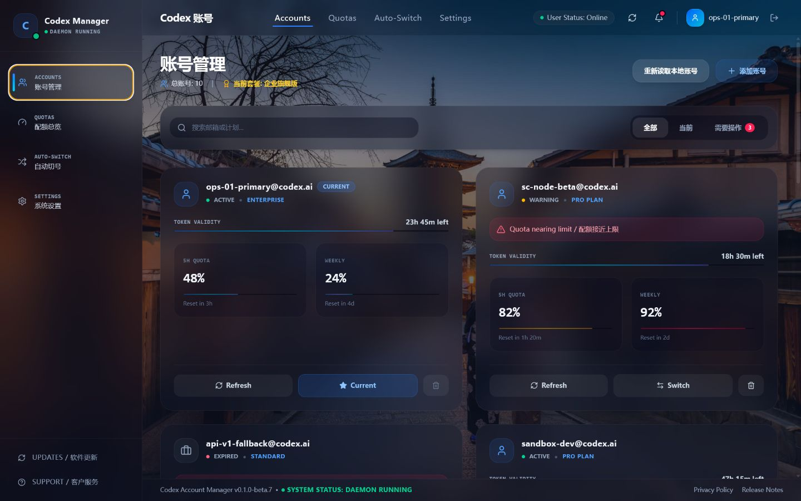

<div align="center">

# Codex Account Manager

面向 Windows 的本地优先 Codex 多账号控制台。

在一处查看每个账号的 5 小时与周额度、Token 状态，并安全切换当前 Codex 身份。

[](https://github.com/3xiaoshayu/codex-account-manager/releases)
[](https://github.com/3xiaoshayu/codex-account-manager/actions/workflows/ci.yml)

[](LICENSE)

[下载](https://github.com/3xiaoshayu/codex-account-manager/releases) ·
[故障排查](docs/troubleshooting.md) ·
[隐私说明](docs/privacy.md) ·
[English](README.en.md)

</div>



> [!IMPORTANT]
> 当前版本为 Windows x64 预发布版，安装包尚未进行代码签名。Windows SmartScreen
> 可能显示“未知发布者”，请只从本仓库 Releases 下载并核对 SHA-256。

## 为什么使用它

Codex Account Manager 专注于一个具体工作流：让多个 Codex 账号的状态清楚、切换可控。

| 能力 | 说明 |
| --- | --- |
| 卡片式额度 | 每个账号固定显示 5 小时额度、周额度和重置时间 |
| 后台同步 | 自动更新缺失或过期的额度数据，同时保留手动刷新 |
| 一键切换 | 更新本机 Codex 登录状态并重新启动官方 Codex 客户端 |
| Token 健康 | 显示过期状态、剩余时间，并支持单账号或批量刷新 |
| 自动切号 | 可配置额度阈值、候选范围和本地守护进程 |
| 账号维护 | OAuth 添加、删除、订阅刷新和可用重置额度管理 |
| 本地优先 | 不提供项目自建云服务，不上传账号列表或 Token |

本工具不会增加、绕过或修改任何账号额度。自动切号只会在你明确保存的账号之间，
依据本地配置选择可用账号。

## 安装

### 系统要求

- Windows 10 或 Windows 11，x64
- 已安装 Microsoft Store 提供的官方 Codex 应用
- 可访问 OpenAI OAuth、ChatGPT 与 GitHub Releases

### 下载与首次使用

1. 打开 [GitHub Releases](https://github.com/3xiaoshayu/codex-account-manager/releases)。
2. 下载最新的 `Codex.Account.Manager-Setup-<version>-x64.exe`。
3. 完成安装并启动应用。
4. 点击“添加账号”，在浏览器中完成 OAuth 登录。
5. 返回应用后确认账号卡片、额度和当前账号状态。

ZIP 包提供免安装运行方式，但运行数据仍保存在 Windows 用户目录中，并不是完全便携版。
普通用户推荐使用 Setup 安装包。

Beta 版本采用手动更新；未来不含预发布标识的稳定版本会在后台下载更新，并在安装前提示重启。

### 校验下载

每个 Release 都包含 `SHA256SUMS.txt`。在 PowerShell 中运行：

```powershell
Get-FileHash ".\Codex.Account.Manager-Setup-<version>-x64.exe" -Algorithm SHA256
```

将输出与 `SHA256SUMS.txt` 中对应文件的哈希值比较。

## 数据与隐私

- 管理器数据位于 `%USERPROFILE%\.codex-switch`。
- OAuth Token 使用 Windows DPAPI 加密，只能由同一 Windows 登录用户解密。
- 当前 Codex 登录状态写入 `%USERPROFILE%\.codex\auth.json`。
- 切换前会保留 `%USERPROFILE%\.codex\auth.json.bak`。
- 应用不包含遥测、广告或项目自建账号同步服务。
- OAuth、Token 刷新、额度、订阅和更新检查会访问相应的 OpenAI、ChatGPT 与 GitHub 服务。

DPAPI 不能防御已经控制当前 Windows 用户会话的恶意软件或管理员。完整的数据清单、
网络请求和卸载说明见 [隐私说明](docs/privacy.md)。

> [!WARNING]
> 切换账号会关闭正在运行的 `Codex.exe` 及关联的 `node_repl.exe`，写入新的认证状态后
> 重新启动 Codex。切换前请等待正在执行的任务完成。

## 工作原理

1. OAuth 登录完成后，应用将账号元数据和经 DPAPI 加密的 Token 保存在本机。
2. 配额同步使用该账号的本地认证状态读取 5 小时和周额度窗口。
3. 切换账号时，应用备份并原子更新 Codex 的 `auth.json`。
4. 自动切号守护进程在本地评估阈值，满足条件时执行同一套切换流程。

配额与重置额度依赖已认证的 ChatGPT 后端接口。这些接口可能发生变化；读取失败时，
应用会保留明确的错误状态，而不会把缺失数据伪装成零额度。

更详细的模块边界与数据流见 [架构说明](docs/architecture.md)。

## 从源码运行

需要 Node.js 20 或更高版本。

```powershell
git clone https://github.com/3xiaoshayu/codex-account-manager.git
cd codex-account-manager
npm ci
npm run check
npm start
```

构建未安装目录：

```powershell
npm run build:dir
```

生成 NSIS 安装包与 ZIP：

```powershell
npm run build:windows
```

如果 electron-builder 辅助包下载超时，可临时设置镜像：

```powershell
$env:ELECTRON_BUILDER_BINARIES_MIRROR="https://npmmirror.com/mirrors/electron-builder-binaries/"
npm run build:windows
```

## 项目文档

- [架构说明](docs/architecture.md)
- [隐私说明](docs/privacy.md)
- [故障排查](docs/troubleshooting.md)
- [贡献指南](CONTRIBUTING.md)
- [安全策略](SECURITY.md)
- [发布流程](docs/releasing.md)
- [版本记录](CHANGELOG.md)
- [支持渠道](SUPPORT.md)

## 项目状态

当前仅支持 Windows x64 与 Microsoft Store 官方 Codex。预发布版本可能调整本地存储格式、
接口解析和自动切号策略。提交问题前请先阅读 [故障排查](docs/troubleshooting.md)。

## 责任与商标

本项目是独立的社区工具，与 OpenAI 没有隶属、授权或背书关系。OpenAI、Codex 与
ChatGPT 是其各自权利人的商标。

请仅管理你本人拥有或被明确授权使用的账号，并遵守适用的服务条款与组织政策。
生产或商业 API 工作负载应使用 OpenAI Platform API，而不是依赖本工具进行账号轮换。

## 许可证

源代码使用 [MIT License](LICENSE)。富士山背景图片采用单独分发许可，不属于 MIT
授权范围，见 [ASSET_LICENSE.md](ASSET_LICENSE.md)。第三方组件许可见
[THIRD_PARTY_NOTICES.md](THIRD_PARTY_NOTICES.md)。

README 截图中的邮箱、额度和日期均为虚构演示数据。
